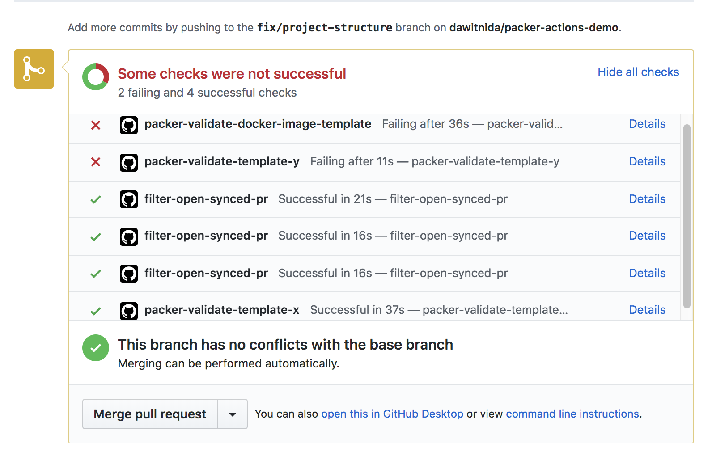

# Packer Github Actions

These is unofficial Packer [GitHub Actions][github-actions] which allows you to run packer validation and inspection on 
pull requests to review Packer template changes and potentially build on pull merge.
Check out the [official Packer documentation][packer-doc] for further reference. 


### DONE

- Documentations
    - [x] Getting started & usage
    - [x] Actions details
- Action for 
    - [x] Validate Action
    - [x] Inspect Action
    - [x] Build Action
    - [x] Directory set for all actions
    
### TODOs
- Improvements
    - [ ] Multiple template validation
    - [ ] Documentation with more screen shots & configuration instructions
    - [ ] Blog post


### Getting started and usage

To check this in action, please check [Packer actions demo project][packer-actions-demo] with a collection
of sample packer template files. 

Variables 

- `PACKER_ACTION_WORKING_DIR` : Working directory
- `TEMPLATE_FILE_NAME` : Packer template file
- `ACTION_COMMENT` : Enable/Disable PR comment from validate result

```
name: Validate packer template file in a directory

on:
  pull_request:
jobs:
  packer_validate:
    runs-on: hashicorp/packer:1.6.4
    steps:
      - name: Packer validate template-y without argument
        uses: dawitnida/packer-github-actions/validate@master
        env:
          GITHUB_TOKEN: ${{ secrets.GITHUB_TOKEN }}
          TEMPLATE_FILE_NAME: ${{ env.TEMPLATE_FILE_NAME }}
```

```
workflow "packer build template-y" {
  resolves = "packer-build-template-y"
  on = "release"
}

action "packer-build-template-y" {
  uses = "dawitnida/packer-github-actions/build@master"
  needs = "packer-inspect-template-y"
  secrets = [
    "GITHUB_TOKEN",
  ]
  env = {
    TEMPLATE_FILE_NAME = "packer-template-y.json"
  }
}

action "filter-open-synced-pr" {
  uses = "actions/bin/filter@master"
  args = "action 'opened|synchronize'"
}

workflow "packer inspect & validate template-y" {
  resolves = "packer-inspect-template-y"
  on = "pull_request"
}

action "packer-validate-template-y" {
  uses = "dawitnida/packer-github-actions/validate@master"
  needs = "filter-open-synced-pr"
  secrets = [
    "GITHUB_TOKEN",
  ]
  env = {
    TEMPLATE_FILE_NAME = "packer-template-y.json"
  }
}

action "packer-inspect-template-y" {
  uses = "dawitnida/packer-github-actions/inspect@master"
  needs = "packer-validate-template-y"
  secrets = [
    "GITHUB_TOKEN",
  ]
  env = {
    TEMPLATE_FILE_NAME = "packer-template-y.json"
  }
}
```

**Figure 1.** *Packer validate complete check list diagram*


### Author
[Dawit Nida](https://github.com/dawitnida)

[packer-actions-demo]:  <https://github.com/dawitnida/packer-actions-demo>
[github-actions]:       <https://github.com/features/actions>
[packer-doc]:           <https://www.packer.io/docs/index.html>
